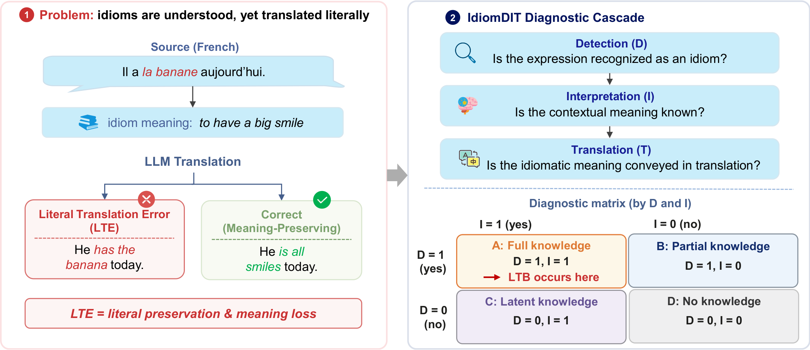
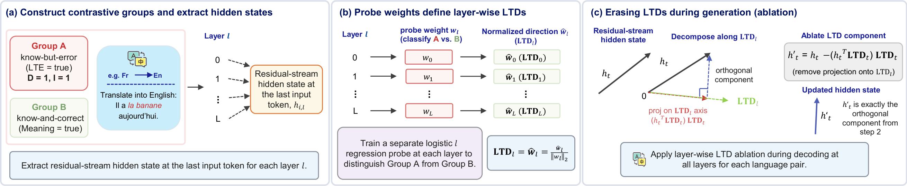

# IdiomDIT

Original implementation for **"Idioms Understood, Yet Translated Literally: Diagnosing Literal Translation Bias in Multilingual LLMs"**.

## Introduction

Large language models often produce literal, word-for-word translations of idiomatic expressions even when they demonstrably understand what the idiom means. **IdiomDIT** is a cascaded diagnostic framework built around idiom **D**etection, **I**nterpretation, and idiomatic **T**ranslation, designed to isolate this failure mode, which we call **Literal Translation Bias (LTB)**.



<p align="center">Left: a Literal Translation Error (LTE) occurs when a model understands an idiom but translates it word-by-word. Right: the IdiomDIT cascade evaluates Detection, Interpretation, and Translation, combining the outcomes into a diagnostic matrix that isolates know-but-error cases as LTB.</p>

Across six language pairs and five models spanning 4B to 70B parameters, LTB persists even when a model detects the idiom and can state its meaning, and how much of the residual error traces back to LTB versus a genuine knowledge gap varies by language direction.

Beyond this behavioral diagnosis, we ask whether LTB is encoded as a specific direction in the model's hidden states. Linear probing recovers a per-layer Literal Translation Direction (LTD) that appears to separate know-but-error instances from know-and-correct ones with high accuracy, but leakage-aware controls show that most of this signal reflects the probe recognizing which idiom it is looking at rather than a genuine bias direction. Erasing the LTD during generation does reduce LTE, but no more than a matched random-direction control, so we treat this hidden-state evidence as correlational rather than causal and release these controls as a reusable protocol for such claims in machine translation.



<p align="center">Linear probing and directional ablation pipeline for the Literal Translation Direction (LTD).</p>

## Environment Setup

```bash
pip install -r requirements.txt
cp .env.example .env   # fill in OPENAI_API_KEY
```

Before running anything:
- In `config.py`, set `MODEL_BASE_DIR` (currently `/pretrain-models`) to wherever you keep local HF model weights, or leave translation-model names as HF hub IDs and let `transformers` resolve them.
- The judge/LLM API defaults to the official OpenAI API. Set `OPENAI_API_KEY` in `.env` (and optionally `OPENAI_API_BASE_URL` if you're using a different OpenAI-compatible endpoint).

Models: Qwen3-4B, Qwen3-8B, Qwen3.5-4B, Qwen3.5-9B (behavioral + mechanistic), Llama-3.3-70B-Instruct (behavioral only). Judges: `gpt-4o-mini` for Detection/Interpretation, `gpt-5.2` for LTE.

Everything below is run from the repo root. A few scripts use `evaluation.`-qualified imports (e.g. `from evaluation.eval_translation_lte_v4 import ...`), so put the root on `PYTHONPATH` first:
```bash
export PYTHONPATH="$PWD:$PYTHONPATH"
```

## Running

### Data

Not included in this release. Expected layout:
```
data/{Fa,Fi,Fr,Ja,Ko}-En-Idiom/
  ParallelData/*.csv      # idiom, source sentence, gold translation
  Meaning/*_meanings.json # reference meanings (LLM-extracted)
```
- **Fi/Fr/Ja/Ko**: `script/preprocessData/clean_{fi,fr,ja,ko}_en.py` each download the raw idiom dataset directly over HTTP from its public GitHub source (Fi/Fr/Ja from Liu et al. 2023a's `nightingal3/idiom-translation` subtitle corpus, Ko from `Judy-Choi/KISS-Korean-english-Idioms-in-Sentences-dataSet`) and clean it into the schema above. No manual download needed, just run the script.
- **En-Fa**: sourced pre-cleaned from Rezaeimanesh et al. 2025 (see the paper's references for how to obtain it); there's no auto-fetch script for this one since it arrived already cleaned.
- **Reference meanings**: `script/preprocessData/extract_meaning.py` generates them per-idiom via an LLM (idiom + source sentence + gold translation as a semantic anchor).

Everything below reads/writes under `results/{lang_pair}/{model}/...`, laid out by `config.py`'s `get_config()`.

### 1. Generate model outputs (inference)

```bash
bash run_inference.sh
```
Defaults to all 6 language pairs × all 5 models, loading each model once and running all three IdiomDIT stages under it (`run_all_inference.py --steps 1 2 3 --all-prompts`, one call per model). The three steps are implemented in `inference/detection.py` (step 1), `inference/Interpretation.py` (step 2, 3 rephrased probes per instance), and `inference/translate.py` (step 3, all 4 prompt types). You normally don't call these three files directly. `run_all_inference.py` orchestrates them so the model is loaded only once per run.

Useful overrides: `bash run_inference.sh fi-en ko-en` (subset of pairs), `MODEL=Llama-3.3-70B-Instruct bash run_inference.sh fi-en` (single model), `MAX_SAMPLES=10 bash run_inference.sh fi-en` (smoke test).

### 2. Judge the outputs

```bash
bash run_eval_detection.sh Qwen3.5-9B        # evaluation/eval_detection.py, judge=gpt-4o-mini, all 6 pairs
bash run_eval_interpretation.sh Qwen3.5-9B   # evaluation/eval_interpretation.py, judge=gpt-4o-mini, all 6 pairs
JUDGES=gpt-5.2 bash run_v4_eval.sh Qwen3.5-9B en-fa fa-en fr-en fi-en ja-en ko-en
```
`run_eval_detection.sh`/`run_eval_interpretation.sh` each require a `MODEL` argument and run it across all 6 pairs internally. Repeat once per model (`Qwen3-4B`, `Qwen3-8B`, `Qwen3.5-4B`, `Qwen3.5-9B`, `Llama-3.3-70B-Instruct`) to cover everything Step 1 generated.

`run_v4_eval.sh` (→ `evaluation/eval_translation_lte_v4.py`, output prefix `translation_lte_v4_gpt52`) is the LTE judge used for every reported number in the paper. **Its own default list of language pairs is only `en-fa fa-en ja-en ko-en`: it silently skips `fr-en` and `fi-en` unless you pass all six explicitly**, as in the command above. Also always pass `JUDGES=gpt-5.2`; the script's own default (`"gpt-5.2 gpt-4o-mini"`) additionally runs a gpt-4o-mini variant of this same v4 script that the paper doesn't use. Repeat for each of the other 4 models.

If a score file for a (pair, model) already exists, `run_v4_eval.sh` automatically calls `evaluation/retry_failed_lte_v4.py` instead of re-judging from scratch. It only re-sends the rows whose judgment came back null (API failure/refusal/rate-limit), so re-running the same command is always safe and cheap.

`evaluation/merge_v4_shards.py` is only needed if you parallelize a single (pair, model)'s judging across multiple shard processes yourself (e.g. splitting a large direction like Ja→En by prompt type across workers). It merges the resulting `*_shard*.json` files back into one `{prefix}_score.json`. Skip it if you just ran `run_v4_eval.sh` as shown above.

`exclusion_utils.load_exclusion_set()` (used by the Sankey/cascade/prompt-mitigation scripts below) reads an optional `results/{pair}/{model}/exclusion_key.json` to skip rows with a persistently-null judgment; a missing file is treated as "nothing excluded," so there's no separate step required here.

### 3. Behavioral results: Findings 1–5

```bash
python analysis/visualize_sankey_grid.py             # Figure 2 (cascade Sankey, all 6 pairs)
python analysis/visualize_prompt_mitigation_stacked.py  # Figure 3 (prompt-mitigation bars)
```
Both default to reading the `legacy` (old-judge) score file for backward compatibility. Pass `--judge v4-gpt52` explicitly to read the paper's actual GPT-5.2 judgments, e.g. `python analysis/visualize_prompt_mitigation_stacked.py --model Qwen3.5-9B --judge v4-gpt52`.

### 4. Mechanistic results: Findings 6–8 (Qwen3.5-9B only)

```bash
bash mechanistic/run_v4_gpt52_qwen9b.sh                      # main all-layer LTD ablation (Table 5)
bash mechanistic/run_v4_gpt52_random_qwen9b.sh 42 0          # matched random-direction control, seed 42 on GPU 0
bash mechanistic/run_v4_gpt52_random_qwen9b.sh 43 1          # ...seed 43 on GPU 1
bash mechanistic/run_v4_gpt52_random_qwen9b.sh 44 2          # ...seed 44 on GPU 2 (paper's ΔLTE(rand.) = mean of these 3)

bash mechanistic/run_v4_gpt52_basic_qwen9b.sh                 # Basic-prompt-only robustness check (Table 9)
bash mechanistic/run_v4_gpt52_basic_random_qwen9b.sh 42 0     # + its own seed 42/43/44 random-direction control
bash mechanistic/run_v4_gpt52_basic_random_qwen9b.sh 43 1
bash mechanistic/run_v4_gpt52_basic_random_qwen9b.sh 44 2

bash mechanistic/run_v4_gpt52_peak_qwen9b.sh                  # GroupCV-peak-layer robustness check (Table 10)
bash mechanistic/run_v4_gpt52_peak_random_qwen9b.sh 42 0
bash mechanistic/run_v4_gpt52_peak_random_qwen9b.sh 43 1
bash mechanistic/run_v4_gpt52_peak_random_qwen9b.sh 44 2

bash mechanistic/run_v4_gpt52_naivepeak_qwen9b.sh             # naive-CV-peak-layer check (Table 3's "Peak L")
bash mechanistic/run_v4_gpt52_naivepeak_random_qwen9b.sh 42 0
bash mechanistic/run_v4_gpt52_naivepeak_random_qwen9b.sh 43 1
bash mechanistic/run_v4_gpt52_naivepeak_random_qwen9b.sh 44 2
```
Each of the four main drivers (`_qwen9b.sh`, `_basic_qwen9b.sh`, `_peak_qwen9b.sh`, `_naivepeak_qwen9b.sh`) runs the same internal chain over all 6 language pairs: `mechanistic/extract_known_lte_groups.py` (build the know-but-error Group A / know-and-correct Group B contrast sets from the v4 judgments) → `mechanistic/probe_ltb_by_hidden_state_balanced.py` (train the per-layer linear probe, cache the recovered LTD) → `mechanistic/direction_ablation_generation.py` (ablate the LTD from the residual stream and regenerate translations) → `evaluation/eval_translation_lte_v4.py` (re-judge baseline and ablated generations with gpt-5.2). Each `_random_*.sh` companion is a **single-seed** run (`<SEED> <GPU_ID>` are required positional args, not optional) that repeats only the ablation+re-judge steps with a random direction of matched norm instead of the probed LTD. Call it three times (seeds 42/43/44, matching the paper) to reproduce the reported random-direction control. The `*_judge_local.sh` variants (not shown above) are for resuming just the local re-judging step if a GPU run finished but the judging pass got interrupted.

```bash
python analysis/aggregate_ablation.py --model Qwen3.5-9B --ablation-name ablation_v4gpt52   # Table 5
python analysis/aggregate_basic_only_ablation.py # Table 9 (hardcoded to Qwen3.5-9B, no flags needed)
python analysis/aggregate_peak_ablation.py       # Table 10, GroupCV peak (same, no flags)
python analysis/aggregate_naivepeak_ablation.py  # Table 10, naive peak (same, no flags)
python analysis/audit_ablation_fix.py --model Qwen3.5-9B --lang-pair en-fa   # Table 8, run once per pair
python analysis/check_ltd_cosine.py              # Finding 7 orthogonality check, Figure 6 data
python analysis/plot_ltd_geometry.py             # Figures 6-8
python analysis/plot_ltd_principal_angles.py     # LTD subspace robustness (Appendix)
python analysis/plot_all_layer_probing.py        # Figure 5 (all-layer probing curve)
python prompt_type_only_baseline.py              # Finding 6: "prompt type alone stays near chance" control
```
`aggregate_ablation.py`'s `--ablation-name` default (`ablation_Lall_dir_ablate_allprompts`) is a leftover from an earlier naming scheme and won't match what `run_v4_gpt52_qwen9b.sh` actually wrote (`ablation_v4gpt52_*`). Always pass `--ablation-name ablation_v4gpt52` as shown. `audit_ablation_fix.py` has no "all pairs" mode; loop over the 6 pairs yourself if you want every Table 8 candidate. Add `--kind harm` to see harm cases (baseline correct → ablation LTE) instead of fixes.

Table 3's naive (random-fold) probing numbers and Table 4's GroupKFold-by-idiom / within-idiom-permutation controls are both produced by `mechanistic/probe_ltb_by_hidden_state_balanced.py` itself (different CV-scheme flags). See its module docstring for the exact flags per row.
